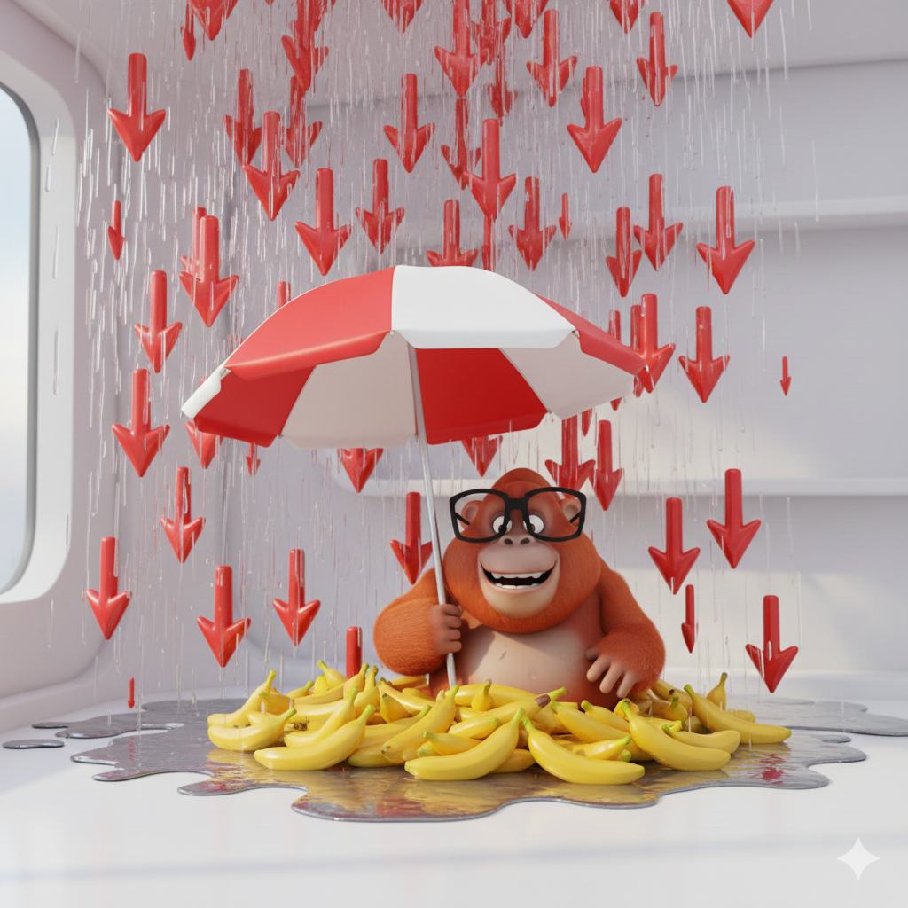
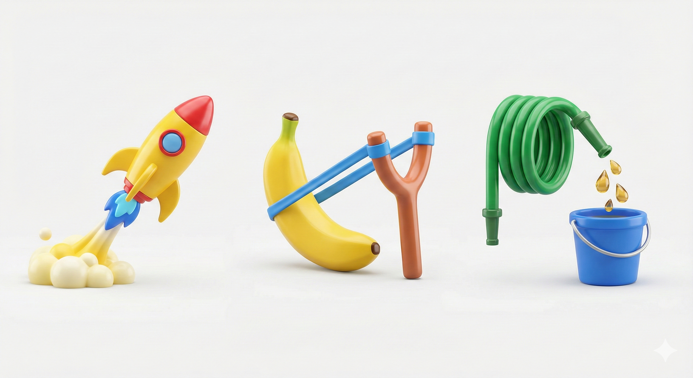

# 🦧 Ukkie Trader: 신중한 오랑우탄처럼 거래하라

> **"바나나가 익었을 때만 움직인다. 행동하기 전에 계획을 얼린다. 살아남는 것이 유일한 엣지다."**


**Ukkie Trader**는 단순한 봇이 아닙니다. 파이썬으로 감싼 하나의 "철학"입니다. 10개의 엄격한 에이전트 검증 파이프라인을 통해 모든 매매 전략이 1원이라도 걸기 전에 견고하고, 시장 상황을 인지하며, 수학적으로 건전한지 확인합니다.

---

## 🍌 오랑우탄 철학 (생각 -> 코드)

퀀트 트레이딩의 핵심은 어려운 수학이 아니라 **규칙**입니다. 우리는 숲속의 원초적인 지혜를 엄격한 알고리즘으로 번역합니다.

### 1. 전략의 4가지 기둥

| 오랑우탄 논리 (우끼우끼) | 퀀트 알고리즘 번역 |
|-------------------|------------------------|
| **"바나나 냄새 나면 들고 간다. 냄새 없으면 던진다."** | **Signal & Exit**: 정확한 진입(Signal > Threshold) 및 청산(Signal Decay) 조건 정의. |
| **"언제 들어가?"** | **진입 트리거**: 예: `RSI < 30` AND `Vol > MA(20)`. |
| **"언제 나가?"** | **청산 트리거**: 예: `수익 > 5%` OR `시간 > 24h` OR `신호 반전`. |
| **"얼마나 들어가?"** | **포지션 사이징**: 변동성 타겟팅(Volatility Targeting) 또는 켈리 공식. |
| **"언제 멈춰?"** | **리스크 컷**: 하드 스탑로스(Stop Loss) 및 최대 낙폭(MDD) 제한. |

### 2. 황금 체크리스트 (좋은 전략 조건)

| 조건 | 오랑우탄 테스트 🍌 | 퀀트 지표 📊 |
|-----------|------------------------|---------------------|
| **엣지 (Edge)** | *"먹었는데 배 안 차면 가짜다."* | **순 기대값(Net Expectancy) > 0** (수수료/슬리피지/임팩트 제외 후). |
| **리스크 (Risk)** | *"한 방에 죽으면 나쁜 전략. 오래 살아남으면 좋은 전략."* | **수익 < 생존**. 낮은 MDD, 견딜 수 있는 손실 구간(Drawdown Duration). |
| **실행 (Execution)** | *"나무 위에서 바나나 봤는데 손이 안 닿으면 굶는다."* | **체결률 & 레이턴시**. 실제 유동성 환경에서 실행 가능한 전략이어야 함. |

### 3. 오랑우탄이 좋아하는 단순 강한 뼈대 3개

| 맛 (Flavor) | 원초적 지혜 | 장점 & 단점 |
|--------|---------------|-------------|
| **모멘텀 (Momentum)** | 🚀 *"무리(추세) 따라가면 산다."* | **장점**: 추세장에서 큰 수익. <br> **단점**: 숲이 고요하면(횡보장) 계속 헛손질(Whipsaw). |
| **평균회귀 (Mean Reversion)** | 🪃 *"가지 휘면 원래대로 돌아온다."* | **장점**: 박스권에서 높은 승률. <br> **단점**: 가지가 부러지는 순간(추세 폭발) 같이 추락함. |
| **캐리/베이시스 (Carry/Basis)** | 💧 *"매일 바나나 조금씩 주는 나무."* | **장점**: 꾸준한 소득. <br> **단점**: 레짐이 바뀌면 "안전해 보이던 나무"가 독나무로 돌변. |

---

## 🧠 예시: "우끼"를 코드로 번역하기

**유저 아이디어**: "추세가 터질 때만 타고 싶어!"

**알고리즘 설계**:
- **신호**: `가격 > 24시간 고점` (추세) + `IV > 50분위` (움직일 이유 있음).
- **진입**: 신호 발생 시 롱(Long).
- **청산**: `가격 < 24시간 저점` OR `IV < 25분위` (변동성 죽음).
- **사이징**: `타겟변동성 / 현재변동성` (조용하면 크게, 시끄러우면 작게).
- **필터**: `스프레드 < 5bps` (가시 덤불은 피한다).

> **한 줄 요약**: "움직일 때만 타고, 시끄러우면 작게 타고, 이상하면 나무에서 내려온다. 우끼우끼."

---

## 🛡️ 10-에이전트 파이프라인의 보호

우리는 전략을 그냥 "돌리지" 않습니다. 혹독하게 검증합니다.

```mermaid
graph LR
    A[연구 단계] --> B[검증 단계]
    B --> C[결정 단계]
    
    subgraph Phase A
    P(제안자 Proposer) --> F(동결자 Freezer) --> QA(데이터 QA)
    end
    
    subgraph Phase B
    QA --> BT(백테스팅)
    BT --> CS(비용/슬리피지)
    CS --> ES(체결 시뮬)
    ES --> RS(리스크/스트레스)
    RS --> OA(과최적화 감사)
    OA --> PC(포트폴리오 용량)
    end
    
    subgraph Phase C
    PC --> O{지휘자 Orchestrator}
    O -->|통과| 승인 (APPROVE)
    O -->|실패| 거절 (REJECT)
    end
```

### 주요 에이전트
- **🕵️ 데이터 QA**: 역사책(데이터)이 찢어지거나 조작되지 않았는지 검사합니다.
- **📝 동결자 (Freezer)**: 계획을 해시(Hash)로 얼립니다. 게임 중간에 룰 바꾸기 금지!
- **📉 비용/슬리피지**: 현실 세계의 마찰을 시뮬레이션합니다 (`sqrt(size)` 임팩트 모델).
- **👮 과최적화 감사 (Overfit Auditor)**: 운을 실력으로 착각하지 않도록 **DSR(Deflated Sharpe Ratio)**을 적용합니다.
- **⚖️ 지휘자 (Orchestrator)**: 장로 오랑우탄입니다. **하드 게이트**(Sharpe > 1.5, MDD < 15%)를 통과 못하면 가차 없습니다.

---

## 🚀 시작하기

### 1. 설치
```bash
git clone https://github.com/yourname/ukkie-trader.git
cd ukkie-trader
pip install -e .
```

### 2. 전략 제안하기
```bash
ukkie propose "MyFirstTrend" "trend_following_v1.py"
```

### 3. 검증의 숲 통과하기
```bash
ukkie validate STRAT-12345
```

---

<div align="center">
  <sub>Ukkie 팀이 🍌와 Python으로 만들었습니다.</sub>
</div>
