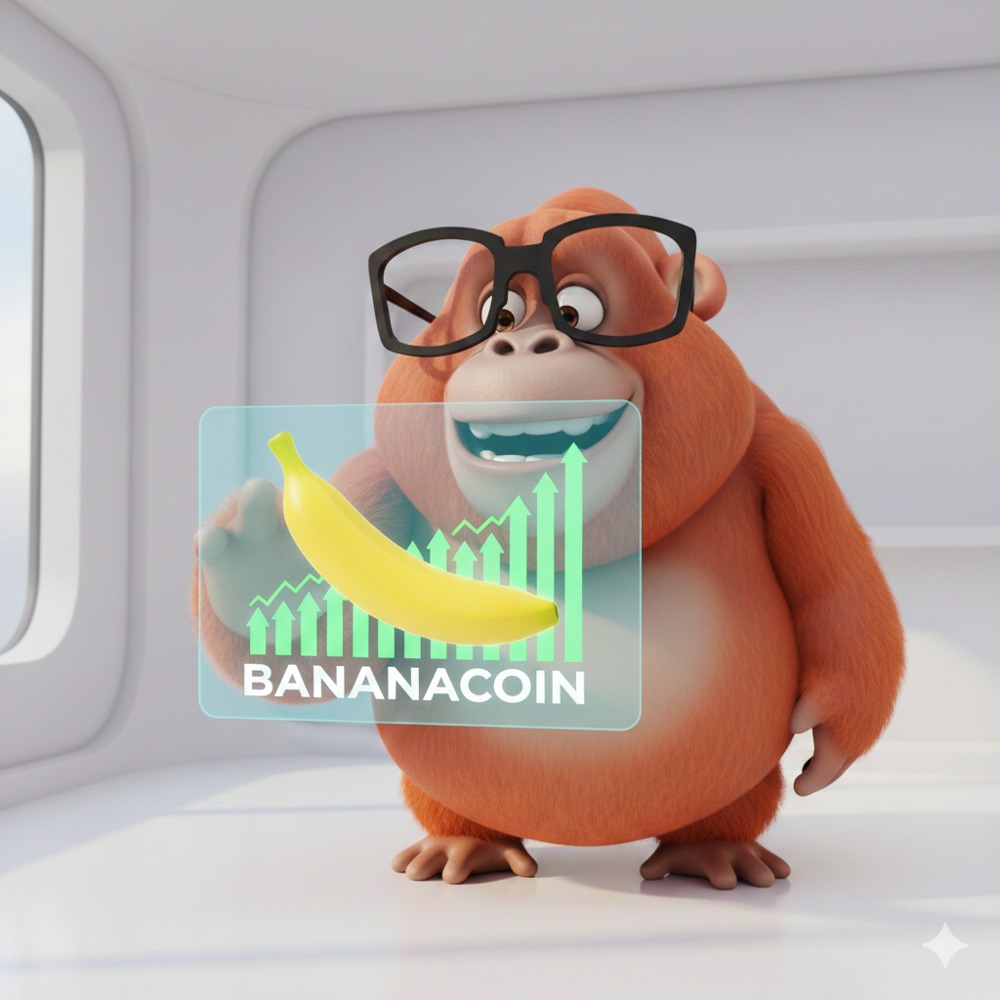
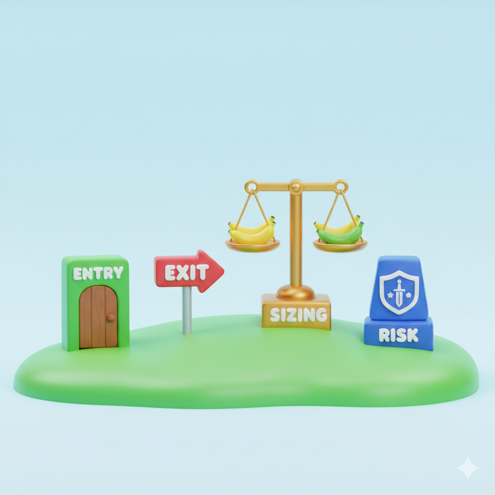
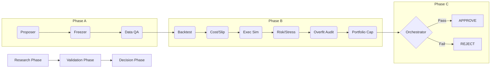

# 🦧 Ukkie Trader: Trade Like a Prudent Orangutan

<div align="center">

[](README.md)
[](README-kr.md)

[](https://www.python.org/)
[](LICENSE)
[](http://makeapullrequest.com)

</div>

**Ukkie Trader** is the core engine for our official landing page at [ukkie-trader.vercel.app](https://ukkie-trader.vercel.app). Check it out for a visual deep dive into the Ukkie philosophy!

> **"Moves only when the banana is ripe. Specs frozen before action. Survival is the only edge."**



**Ukkie Trader** is not just a bot; it's a philosophy wrapped in Python. It enforces a strict, 10-agent validation pipeline to ensure that every trading strategy is robust, regime-aware, and mathematically sound *before* it ever risks a single cent.

---

## 🍌 The Orangutan Philosophy (Thinking -> Code)

Quant trading isn't about complex math; it's about disciplined rules. We translate the primal wisdom of the forest into rigorous algorithmic enforcement.

### 1. The 4 Pillars of Strategy

| Orangutan Logic (Udder Uqqi) | Quant Algo Translation |
|-------------------|------------------------|
| **"Smell banana, hold. No smell, drop."** | **Signal & Exit**: Define precise Entry (Signal > Threshold) and Exit (Signal Decay) conditions. |
| **"When enter?"** | **Entry Trigger**: e.g., `RSI < 30` AND `Vol > MA(20)`. |
| **"When leave?"** | **Exit Trigger**: e.g., `Profit > 5%` OR `Time > 24h` OR `Signal Reversal`. |
| **"How much?"** | **Position Sizing**: Volatility Targeting or Kelly Criterion. |
| **"When stop?"** | **Risk Cut**: Hard Stop Loss and Max Drawdown limit. |

### 2. The Golden Checklist (Good Strategy)

| Condition | The Orangutan Test 🍌 | The Quant Metric 📊 |
|-----------|------------------------|---------------------|
| **Edge** | *"Eat banana but still hungry? Fake banana."* | **Net Expectancy > 0** (After Fees/Slippage/Impact). |
| **Risk** | *"Dead monkey eats no fruit."* | **Survival > Profit**. Low MDD, manageable Drawdown Duration. |
| **Execution** | *"See banana but arm too short? Starve."* | **Fill Rate & Latency**. Strategy must be executable in real liquidity conditions. |

### 3. Simple Strategy Flavors

| Flavor | Primal Wisdom | Pros & Cons |
|--------|---------------|-------------|
| **Momentum** | 🚀 *"Follow the herd running to fruit."* | **Pro**: Big wins in trends. <br> **Con**: Whipsaws in flat markets (The "Forest is quiet" trap). |
| **Mean Reversion** | 🪃 *"Bent branch snaps back."* | **Pro**: High win rate in ranges. <br> **Con**: Catastrophic failure if branch breaks (Trend explosion). |
| **Carry/Basis** | 💧 *"Collecting sap drp by drop."* | **Pro**: Steady income. <br> **Con**: Regime shift turns "safe tree" into "poison tree". |

---

## 🧠 Example: Translating "Ukkie" to Code

**User Idea**: "Ride the trend when it's moving!"

**Algorithm Design**:
- **Signal**: `Price > 24h High` (Trend) + `IV > 50th Percentile` (Reason to move).
- **Entry**: Long on Signal.
- **Exit**: `Price < 24h Low` OR `IV < 25th Percentile` (Volatility death).
- **Sizing**: `TargetVol / CurrentVol` (Big when quiet, small when loud).
- **Filter**: `Spread < 5bps` (Don't climb thorny trees).

> **Summary**: "Move when it moves, shrink when it's loud, get down if it's weird. Ukkie."

---

## 🛡️ The 10-Agent Pipeline protection

We don't just "run" strategies. We grill them.



### Key Agents
- **🕵️ Data QA**: Checks if the history books (data) are torn or fake.
- **📝 Freezer**: Hashes the plan. No changing rules mid-game!
- **📉 Cost/Slippage**: Simulates the friction of the real world (`sqrt(size)` impact).
- **👮 Overfit Auditor**: Applies the **Deflated Sharpe Ratio (DSR)** to catch luck disguised as skill.
- **⚖️ Orchestrator**: The Elder. Enforces **Hard Gates** (Sharpe > 1.5, MDD < 15%).

---

---

## 🧘 Zen of Ukkie

The core philosophy of this project is available in the [Zen of Ukkie](ZEN.txt) (Korean).

View the live **Zen Mode** on the web: [https://ukkie-trader.vercel.app](https://ukkie-trader.vercel.app)

You can also read it directly in your terminal:
```bash
ukkie zen
```

---

## 🚀 Getting Started

### 1. Installation
```bash
git clone https://github.com/yourname/ukkie-trader.git
cd ukkie-trader
pip install -e .
```

### 2. Propose a Strategy
```bash
ukkie propose "MyFirstTrend" "trend_following_v0.1.0.py"
```

### 3. Run the Gauntlet
```bash
ukkie validate STRAT-12345
```

---

## 🤝 Contributing

We welcome contributions from fellow Orangutans! Whether it's a new strategy, a bug fix, or a documentation improvement, your help is appreciated.

1. **Fork** the repository.
2. **Create** a feature branch (`git checkout -b feature/AmazingStrategy`).
3. **Commit** your changes (`git commit -m 'Add AmazingStrategy'`).
4. **Push** to the branch (`git push origin feature/AmazingStrategy`).
5. **Open** a Pull Request.

### Development Setup
```bash
git clone https://github.com/yourname/ukkie-trader.git
cd ukkie-trader
pip install -e ".[dev]"
```

## 📄 License

Distributed under the MIT License. See `LICENSE` for more information.

---

<div align="center">
  <sub>Built with 🍌 and Python by the Ukkie Team.</sub>
</div>
